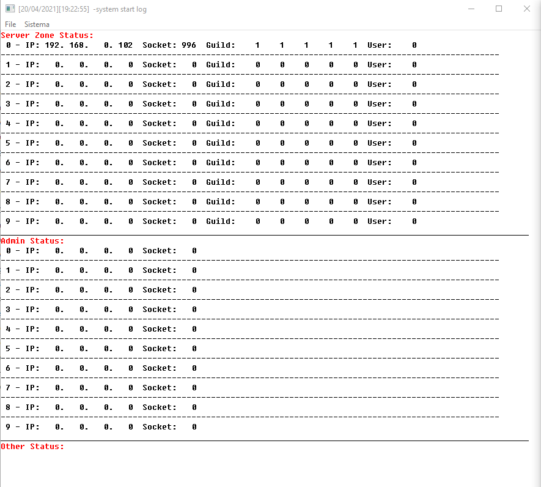
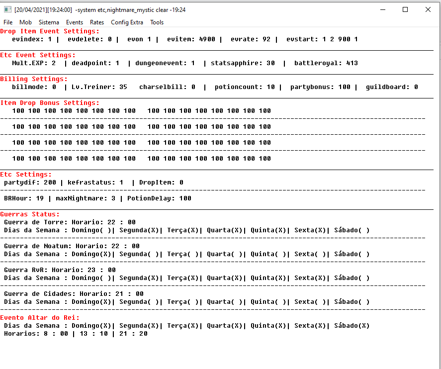

# WydEmulator
Emulator based  w2pp WYD(MMORPG)
Log:
1. Correção evocações BM ----------------------------------------------------------------------------------(x)

2. Converter leitura de binario base de criação dos personagens para json ---------------------------------(x)

3. Converter leitura de config.txt para json --------------------------------------------------------------(x)

4. converter leitura de ips de txt para json --------------------------------------------------------------(x)

5.mudança no sistema de double exp para multiplicador de exp exemplo 1x,2x,3x,4x+++ -----------------------(x)

6.implementação de macro auto perga -----------------------------------------------------------------------(x)

7. criação de um novo item(fada) 7dias para incorporar macro auto perga -----------------------------------(x)

8. criação de sistema de grupo com senha:

comandos: 

DefGroupPass +password[5] -> defini uma senha para seu grupo ----------------------------------------------(x)

GroupPass -> exibe a senha atual do seu grupo -------------------------------------------------------------(x)

GroupEnter +nick[16] +password[5] -> entra em um grupo pré-definido por senha -----------------------------(x)

9. correção/implementação de contador de tempo para novos itens do tipo fada do lado do client ------------(x)

10. Inclusão das joias pvp --------------------------------------------------------------------------------(x)

11. Correção criação de archs -----------------------------------------------------------------------------(x)

12. Correção guerra do gelo -------------------------------------------------------------------------------(x)

13. inclusão das poções sephira/saude ---------------------------------------------------------------------(x)

14. Correção Tempo das montarias clientSide ---------------------------------------------------------------(x)

15. correção tempo das fadas clientSide -------------------------------------------------------------------(x)

16. bloqueio por ip/mac nas lans --------------------------------------------------------------------------(x)

17. criação do packet de Quiz ServerSide ------------------------------------------------------------------(x)

18. criação packet de Quiz ClientSide ---------------------------------------------------------------------(x)

19. correção dano visual das montarias ClientSide ---------------------------------------------------------(x)

20. correção hook preço dos itens na loja ClientSide ------------------------------------------------------(x)

21. Criação sistema de Quiz via arquivo json --------------------------------------------------------------(x)

22. inclusão do sistema de quiz nas lans ------------------------------------------------------------------(x)

23. correção crash no servidor provocado pelo Struct item -------------------------------------------------(x)

24. implementação de novo sistema de refino com Oir/Lac via json ------------------------------------------(x)

25. Separação por arquivo e correção nas guerras de Noatum e cidades --------------------------------------(x)

26. separação por aquivo e acerto na guera RvR ------------------------------------------------------------(x)
27. Evento Altar do Rei via json --------------------------------------------------------------------------(x)
28. Evento Box itens configuravel via json ----------------------------------------------------------------(x)
29. Evento Invasão de armia via json ----------------------------------------------------------------------(x)
30. Evento LojaAfk ----------------------------------------------------------------------------------------(x)
31. Evento Loteria ----------------------------------------------------------------------------------------(x)
32. Evento de Troca via json ------------------------------------------------------------------------------(x)
33. Evento novato VemProEternal ---------------------------------------------------------------------------(x)
34. BagWarrior, premio via json ---------------------------------------------------------------------------(x)
35. Colizeu via json --------------------------------------------------------------------------------------( )
36. Drop kefra para guild de quem matou via json ----------------------------------------------------------(x)
37. Sistema de Auto Double exp via json -------------------------------------------------------------------(x)
38. Sistema de contador de classe/evo via json ------------------------------------------------------------(x)
39. Sistema de agrupamento de item por fada via json ------------------------------------------------------(x)
40. Sistema de itens agrupaveis via json ------------------------------------------------------------------(x)
41. Sistema de guild lvl via json -------------------------------------------------------------------------(x)
42. Sistema de Status do servidor podendo deixar server online somente para staff(manutenção) via json ----(x)
43. Sistema de Titulo no tab via json ---------------------------------------------------------------------(x)
44. Configuração dos horarios das guerras via json --------------------------------------------------------(x)
45. Sistema de Bloqueio de npc via json -------------------------------------------------------------------(x)
46. Sistemade Guild Hall via json -------------------------------------------------------------------------(x)
47. Sistema de territorio guild via json -----------------------------------------------------------------(80%)
48. Sistema de Admin por account via json -----------------------------------------------------------------(x)
49. Sistema de SaveBuff podendo salvar novos buffs como bau de xp na conta -------------------------------(70%)
50. Sistema de npc via json ------------------------------------------------------------------------------(20%)
51. Menu para reload de todos os configs json ------------------------------------------------------------(x)
52. Sistema de boss nos campos via json ------------------------------------------------------------------(x)
53. Novo Boss Sombra Negra via json ----------------------------------------------------------------------(x)
54. Sistema de filtro de nomes para criação de personagem  via json --------------------------------------(x)
55. Buff proteção montaria(marmita) ----------------------------------------------------------------------(x)
56. Com certeza tem muito mais coisa, mais isso é tudo que eu lembrei.

DB:

TM:

